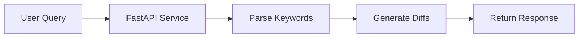

# CodeWeave

Autonomously execute coding tasks within the development environment to reduce context switching and manual editing effo

# Diff Builder MVP

A small FastAPI service that parses natural language queries and generates diff entries for a set of files.

## Usage

Run the server:
uvicorn main:app --reload

Demo:
python -c "from main import demo; demo()"

Tests:
pytest -q

## Architecture

Mermaid source

